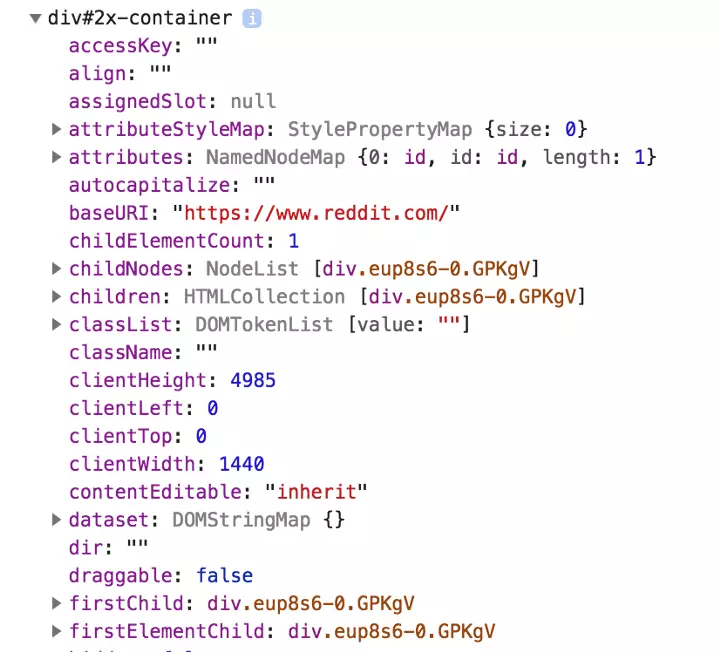

# console的js调试

## console.log()
在`console.log` 中有很多人们意想不到的功能。虽然大多数人使用 `console.log(object)` 来查看对象，但是你也可以使用 `console.log(object, otherObject, string)`，它会把它们都整齐地记录下来，偶尔也会很方便。

不仅如此，还有另一种格式化的： `console.log(msg, values)`，这很像 C 或 PHP 中的sprintf。
```javascript
console.log('I like %s but I do not like %s.', 'Skittles', 'pus');
//  I like Skittles but I do not like pus.
```

常见的占位符 `%o` (这是字母o，不是0)，它接受对象，`%s` 接受字符串，`%d` 表示小数或整数。

另一个有趣的是 `%c`，这可能与你所想不太相同，它实际上是CSS值的占位符。使用`%c`占位符时，对应的后面的参数必须是CSS语句，用来对输出内容进行CSS渲染。常见的输出方式有两种：文字样式、图片输出。


## console.dir()

在大多数情况下，`console.dir()` 的函数非常类似于 `log()`，尽管它看起来略有不同。


下拉小箭头将显示与上面相同的对象详细信息，这也可以从`console.log` 版本中看到。当你查看元素的结构时候，你会发现它们之间的差异更大，也更有趣。
```javascript
let element = document.getElementById('2x-container');
```

使用 `console.log` 查看：


打开了一些元素，这清楚地显示了 DOM，我们可以在其中导航。但是`console.dir(element)`给出了更加方便查看 DOM 结构的输出：

这是一种更客观地看待元素的方式。有时候，这可能是您真正想要的，更像是检查元素。




## console.warn()
可能是最明显的直接替换 `log()`，你可以以完全相同的方式使用 `console.warn()`。 唯一真正的区别是输出字的颜色是黄色的。 具体来说，输出处于警告级别而不是信息级别，因此浏览器将稍微区别对待它。 这具有使其在杂乱输出中更明显的效果。

不过，还有一个更大的优势，因为输出是警告而不是信息，所以你可以过滤掉所有console.log并仅保留console.warn。 这对于偶尔会在浏览器中输出大量无用废话的应用程序尤其有用。 清除一些无用的信息可以让你更轻松地看到你想要的输出。

## console.table()
令人惊讶的是，这并不是更为人所知，但是 `console.table()` 函数旨在以一种比仅仅转出原始对象数组更整洁的方式显示表格数据。

例如，这里有一个数据列表。

```javascript
const data = [{
  id: "7cb1-e041b126-f3b8",
  seller: "WAL0412",
  buyer: "WAL3023",
  price: 203450,
  time: 1539688433
},
{
  id: "1d4c-31f8f14b-1571",
  seller: "WAL0452",
  buyer: "WAL3023",
  price: 348299,
  time: 1539688433
},
{
  id: "b12c-b3adf58f-809f",
  seller: "WAL0012",
  buyer: "WAL2025",
  price: 59240,
  time: 1539688433
}];
```
如果我们使用 `console.log` 来输出上面的内容，我们会得到一些非常无用的输出:
```javascript
▶ (3) [{…}, {…}, {…}]
```

点击这个小箭头可以展开看到对象的内容，但是，它并不是我们想要的“一目了然”。

但是 `console.table(data)` 的输出要有用得多。


第二个可选参数是所需列的列表。显然，所有列都是默认值，但我们也可以这样做:
```javascript
console.table(data, ["id", "price"]);
```
![console.table(data,["id", "price"])](../Assets/console_table_column.png)
这里要注意的是这是乱序的 - 最右边的列标题上的箭头显示了原因。 我点击该列进行排序。 找到列的最大或最小，或者只是对数据进行不同的查看非常方便。 顺便说一句，该功能与仅显示一些列无关，它总是可用的。

`console.table()` 只能处理最多1000行，因此它可能不适合所有数据集。

## console.assert()

`assert()` 与 `log()` 是相同的函数，assert()是对输入的表达式进行断言，只有表达式为`false`时，才输出相应的信息到控制台，示例如下：
```javascript
var arr = [1, 2, 3];
console.assert(arr.length === 4);
```


有时我们需要更复杂的条件句。例如，我们已经看到了用户 `WAL0412` 的数据问题，并希望仅显示来自这些数据的事务，这是直观的解决方案。
```javascript
console.assert(tx.buyer === 'WAL0412', tx);
```
这看起来不错，但行不通。记住，条件必须为`false`，断言才会执行，更改如下：
```javascript
console.assert(tx.buyer !== 'WAL0412', tx);
```

与其中一些类似，`console.assert()` 并不总是特别有用。但在特定的情况下，它可能是一个优雅的解决方案。

## console.count()
另一个具有特殊用途的计数器，count只是作为一个计数器，或者作为一个命名计数器，可以统计代码被执行的次数。

```javascript
for(let i = 0; i < 10000; i++) {
  if(i % 2) {
    console.count('odds');
  }
  if(!(i % 5)) {
    console.count('multiplesOfFive');
  }
  if(isPrime(i)) {
    console.count('prime');
  }
}
```
这不是有用的代码，而且有点抽象。这边也不打算演示 `isPrime` 函数，假设它是成立的。

执行后我们会得到一个列表：
```javascript
odds: 1
odds: 2
prime: 1
odds: 3
multiplesOfFive: 1
prime: 2
odds: 4
prime: 3
odds: 5
multiplesOfFive: 2
...
```

还有一个相关的 `console.countReset()`，可以使用它重置计数器。

## console.trace()
`trace()` 在简单的数据中很难演示。当您试图在类或库中找出是哪个实际调用者导致了这个问题时，它的优势就显现出来了。

例如，可能有 12 个不同的组件调用一个服务，但是其中一个组件没有正确地设置依赖项。

```javascript
export default class CupcakeService {
    
  constructor(dataLib) {
    this.dataLib = dataLib;
    if(typeof dataLib !== 'object') {
      console.log(dataLib);
      console.trace();
    }
  }
  ...
}

```

这里使用 `console.log()` 仅告诉我们传递数据dataLib是什么 ，而没有具体的传递的路径。不过，`console.trace()` 会非常清楚地告诉我们问题出在 Dashboard.js，我们可以看到是 new CupcakeService(false) 导致错误。

## console.time()
`console.time()` 是一个用于跟踪操作时间的专用函数，它是跟踪 JavaScript执行时间的好方法。
```javascript
function slowFunction(number) {
  var functionTimerStart = new Date().getTime();
  // something slow or complex with the numbers. 
  // Factorials, or whatever.
  var functionTime = new Date().getTime() - functionTimerStart;
  console.log(`Function time: ${ functionTime }`);
}
var start = new Date().getTime();

for (i = 0; i < 100000; ++i) {
  slowFunction(i);
}

var time = new Date().getTime() - start;
console.log(`Execution time: ${ time }`);

```

这是一种老派的做法，我们使用 console.time() 来简化以上代码。

```javascript
const slowFunction = number =>  {
  console.time('slowFunction');
  // something slow or complex with the numbers. 
  // Factorials, or whatever.
  console.timeEnd('slowFunction');
}
console.time();

for (i = 0; i < 100000; ++i) {
  slowFunction(i);
}
console.timeEnd();

```

我们现在不再需要做任何计算或设置临时变量。

## console.group()
```javascript
// this is the global scope
let number = 1;
console.group('OutsideLoop');
console.log(number);
console.group('Loop');
for (let i = 0; i < 5; i++) {
  number = i + number;
  console.log(number);
}
console.groupEnd();
console.log(number);
console.groupEnd();
console.log('All done now');con
```
输出如下：


并不是很有用，但是您可以看到其中一些是如何组合的。

```javascript
class MyClass {
  constructor(dataAccess) {
    console.group('Constructor');
    console.log('Constructor executed');
    console.assert(typeof dataAccess === 'object', 
      'Potentially incorrect dataAccess object');
    this.initializeEvents();
    console.groupEnd();
  }
  initializeEvents() {
    console.group('events');
    console.log('Initialising events');
    console.groupEnd();
  }
}
let myClass = new MyClass(false);

```

多调试信息的代码，可能不是那么有用。 但它仍然是一个有趣的想法，这样写使你的日志记录更加清晰。