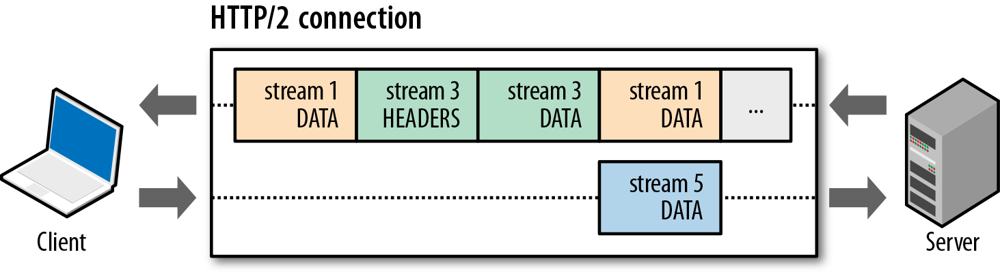

# HTTP/2 介绍

> HTTP/2 是万维网（WWW）基础协议 HTTP 16年来的首次重大升级。共经历了18版草案（00-17），于2015年2月18日正式定稿，2015年5月14日 HTTP/2 正式版发布，正式版 HTTP/2 规格标准叫做 RFC7540 。

参考资料： [前端开发与 HTTP/2 的羁绊——安利篇](https://aotu.io/notes/2016/03/17/http2-char/)

## HTTP/1.x 相关知识

简化版客户端向服务器请求页面
- TCP 连接： 浏览器与服务器三次握手，建立 TCP 连接
- 客户端请求： 建立 TCP 连接后，客户端就会向服务器发送一个 HTTP 请求信息（比如请求 HTML 资源，我们暂且就把这个称为“ HTML 请求”）
- 服务器响应： 服务器接收到请求后进行处理并发回一个 HTTP 响应信息

### HTTP/1.0 的通信
**在 HTTP/1.0 下，每完成一次请求和响应，TCP 连接就会断开**。但我们知道，客户端发送一个请求只能请求一个资源，而我们的网站不可能只有单单一个 HTML 文件吧？至少还要有 CSS 吧？还要有图片吧？于是又要一次 TCP 连接，然后请求和响应。

下图展示了 HTTP/1.0 请求一个 HTML 和一个 CSS 需要经历的两次 TCP 连接：


### HTTP/1.1 的通信
要知道，TCP 连接有 RTT（Round Trip Time，即往返时延）的，每请求一个资源就要有一次 RTT ，用户可是等不得这种慢节奏的响应的。于是**到了 HTTP/1.1 ，TCP 可以持久连接了，也就是说，一次 TCP 连接要等到同域名下的所有资源请求/响应完毕了连接才会断开。**恩！听起来情况好像好了很多，请求同域名下的 n 个资源，可以节约 (n-1)*RTT 的时间。

下图展示了 HTTP/1.1 时请求一个 HTML 和一个 CSS 只需要经历一次 TCP 连接：


HTTP/1.x 多次请求必须严格满足先进先出（FIFO）的队列顺序：发送请求，等待响应完成，再发送客户端队伍中的下一个请求。也就是说，每个 TCP 连接上只能同时有一个请求/响应。


## 那么 HTTP/2 做了什么改变
HTTP/1.1 和 HTTP/2 请求300+张图片的对比
[https://http2.akamai.com/demo](https://http2.akamai.com/demo)

http/2带来了5个新特性
- 二进制分帧层
- 多向请求与响应
- 优先级和依赖性
- 首部压缩
- 服务器推送

### 二进制分帧层（Binary Framing Layer）
> 指的是位于套接字接口与应用可见的高层 HTTP API 之间的一个新机制：HTTP 的语义，包括各种动词、方法、首部，都不受影响，不同的是传输期间对它们的编码方式变了。

在新引进的二进制分帧层上，HTTP/2 将所有传输的信息分割为更小的消息和帧，且都采用二进制格式的编码。


> HTTP/2 同域名的所有通信都是在一个 TCP 连接上完成，这个连接可以承载任意数量的双向数据流。而每个数据流都是以消息的形式发送的，消息由一个帧或多个帧组成。
流：已建立的连接上的双向字节流
消息：与逻辑消息对应的完整的一系列数据帧
帧：HTTP/2 通信的最小单位，每个帧包含帧首部

TCP 连接在客户端和服务器间建立了一条运输的通道，可以双向通行，当一端要向另一端发送消息时，会先把这个消息拆分成几部分（帧），然后通过发起一个流对这些帧进行发送，最后在另一端将同一个流的帧重新组合。


### 多向请求与响应（多路复用）
> 多路复用允许同时通过单一的 TCP 连接发起多重的请求/响应消息，客户端和服务器可以把 HTTP 消息分解为互不依赖的帧，然后乱序发送，最后再在另一端根据 Stream ID 把它们重新组合起来。

前面提到的一端发送消息会先对消息进行拆分，与此同时，也会给同一个消息拆分出来的帧带上一个编号（Stream ID），这样在另一端接收这些帧后就可以根据编号对它们进行组合。



### 优先级和依赖性
> 新建流的终端可以在报头帧中包含优先级信息来对流标记优先级。
优先级的目的是允许终端表达它如何让对等端管理并发流时分配资源。更重要的是，在发送容量有限时优先级能用来选择流来传输帧。

HTTP/2 中，流可以有一个优先级属性（即“权重”）：

- 可以在 HEADERS 帧中包含优先级 priority 属性；
- 可以单独通过 PRIORITY 帧专门设置流的优先级属性。


- 第一种情况：流 A 和流 B 不依赖流，即为 0x0 ；流 A 的权重为 12 ，流 B 的权重为 4 ；则流 A 分配到的资源占比为 12/(12+4)= 12/16，流 B 分配到的资源占比为 4/(12+4)= 4/16。
- 第二种情况：流 D 为 0x0 ，流 C 依赖于流 D ；流 D 能被分配到全额资源，等到流 D 关闭后，依赖于流 D 的流 C 也会被分配到全额资源（它是唯一依赖于流 D 的流，它的权重的大小此时并不重要，因为没有竞争的流）。
- 第三种情况：流 D 为 0x0 ，流 C 依赖于流 D ，流 A 和 流 B 依赖于流 C ；流 D 能被分配到全额资源，等到流 D 关闭后，依赖于流 D 的流 C 也会被分配到全额资源；等到流 C 关闭后，依赖于流 C 的流 A 和流 B 根据权重分配资源（3：1）。
- 第四种情况：流 D 为 0x0 ，流 C 和流 E 依赖于流 D ，流 A 和 流 B 依赖于流 C ；流 D 能被分配到全额资源，等到流 D 关闭后，依赖于流 D 的流 C 的流 E 和流 B 根据权重分配资源（1：1）；等到流 C 关闭后，依赖于流 C 的流 A 和流 B 根据权重分配资源（3：1）。

### 首部压缩
> 在服务器和客户端各维护一个“首部表”，表中用索引代表首部名，或者首部键 - 值对，上一次发送两端都会记住已发送过哪些首部，下一次发送只需要传输差异的数据，相同的数据直接用索引表示即可


### 服务器推送（server Push）
> 服务器可以对一个客户端请求发送多个响应。也就是说，除了对最初请求的响应外，服务器还可以额外向客户端推送资源。


注：由客户端发起的流 Stream ID 为奇数，由服务器发起的流 Stream ID 为偶数

## 小结
- HTTP/2 通过二进制分帧与多路复用机制，有效解决了 HTTP/1.x 下请求/响应延迟的问题
- 新的首部压缩技术使 HTTP/1.x 首部信息臃肿的问题得到解决
- 优先级和依赖性与服务器推送使得我们可以更有效地利用好这个单一的 TCP 连接


## 后记

### HTTP/2给我们的好处
- 多路复用 ：一次TCP握手，多个同域并行请求，请求和响应同时发送接受，然后再拼装组合，不阻塞；
- 优先级和依赖性（Priority） ：可以请求的时候告知服务器端，资源分配权重，优先加载重要资源；
- 服务器推送（Server Push） ：根据客户端需求，服务端主动推送资源，减少请求耗时；

#### 多路复用对比

可以对比下请求细节


#### 服务器推送（Server Push）优势
HTTP/2 Server Push 和 普通请求相比，去掉了请求阶段，直接返回数据（Content Download），数据获取速度更快，而且push中可以嵌入逻辑，并且请求还可以进行缓存。


```javascript
router.get('/serverpush', function (ctx, next){
    var zepto = fs.readFileSync(resolve(root, 'public/js/zepto.js'), { encoding: 'UTF-8' })
    var html = fs.readFileSync(resolve(root, 'public/item2_1.html'), { encoding: 'UTF-8' })
    ctx.res.push('/zepto.js', options, function(err, stream){
        if (err) return;
        zlib.gzip(zepto,function(err, buf){
            stream.end(buf)
        })
    });
    ctx.body = html
})
```

#### 关于优先级和依赖性（Priority）
没有设置Pripority

设置CSS 和 JS 的 Pripority后


设置Pripority后，CSS 和 JS 明显速度更快了，但是代价是牺牲了图片的部分请求的速度。

### HTTP/1.X 的性能优化还有必要吗
#### 雪碧图（Sprite）

根据请求更多其实差距不会体现在请求的多少，而只会体现在请求的响应时间和下载数据的大小，而雪碧图占用的请求应该都是很小的，所以合并与否其实不明显，再考虑到雪碧图的维护成本，其实就HTTP/2来说并不推荐再使用雪碧图了。

#### 分域名
HTTP1.1时代，我们经常会用多个域名来做请求优化，因为浏览器同域名下会有并行请求数限制（根据浏览器不同2-8个，比如IE6只有两个），然而DNS解析又得额外花时间，所以以前对域名的个数还需要根据各自网站找一个平衡点。HTTP/2就不用理会这个了，因为多路复用，并行请求不再是瓶颈，收敛了域名后还能减少DNS解析时间，所以HTTP/2中我们不用再细分域名了。

#### 接口请求
HTTP1.1的时候，我们经常会根据当前的页面，将请求合并成一个。HTTP/2中可以更细粒度的组合你的接口，不用再根据某个页面所需数据，来组合一个专门的无意义的接口了（不用合并请求），不怕请求多，就怕单个请求太慢。

#### 内联资源
首先我们来回顾下，HTTP1.1时代，我们为什么要内联，因为我们希望减少请求，我们为了加快首页的渲染速度，甚至会把首页第一屏的样式内联到HTML中，一起返回，加速首屏渲染。然而当有人想改动首屏任何内容，无论多小都得重新替换掉整个页面。

在HTTP/2下我们可以通过推送的方式给你想要的资源，跟你的HTML请求一块儿返回给你，不仅如此，push的内容还可以进行缓存，多页面共享。